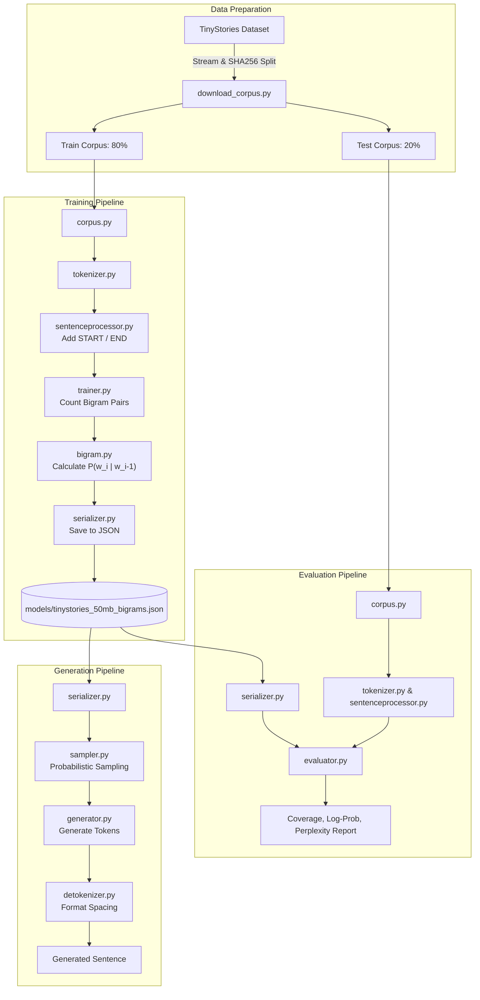

# Statistical Bigram Language Model

[](LICENSE)
[](https://www.python.org/downloads/)

A modular statistical language model built from scratch in Python. It learns word transition probabilities from the [TinyStories](https://huggingface.co/datasets/roneneldan/TinyStories) dataset, generates text by probabilistic sampling, and provides an evaluation suite to measure test coverage, log-likelihood, and perplexity.

This project demonstrates core concepts in Natural Language Processing (NLP) and statistical language modeling: text preprocessing, tokenization, vocabulary construction, Maximum Likelihood Estimation (MLE), autoregressive sampling, punctuation-aware detokenization, and intrinsic model evaluation.

---

## Pipeline Overview



---

## Features

- **Streaming Dataset Downloader**: Streams TinyStories and creates a deterministic 80/20 train/test split using SHA-256 story hashing.
- **Custom Tokenization**: Splits words while isolating punctuation marks.
- **Sentence Boundary Handling**: Automatically wraps sentences with `<START>` and `<END>` tokens for natural beginnings and terminations.
- **Maximum Likelihood Estimation (MLE)**: Computes bigram conditional transition probabilities:
  $$P(w_i \mid w_{i-1}) = \frac{\text{Count}(w_{i-1}, w_i)}{\sum_{w'} \text{Count}(w_{i-1}, w')}$$
- **Model Serialization & Validation**: Saves trained probability distributions as compact JSON, with schema and probability distribution validation.
- **Probabilistic Sampling**: Employs inverse transform (roulette wheel) sampling to generate diverse text based on learned distributions.
- **Punctuation-Aware Detokenization**: Reconstructs natural sentences with custom rules for spaces before, after, and around punctuation marks.
- **Evaluation Suite**:
  - Validates probability distributions ($\sum P = 1.0$).
  - Measures vocabulary size and unique learned bigrams.
  - Computes test set bigram coverage (seen vs. unseen bigrams).
  - Calculates total and average log-probabilities and perplexity.

---

## Setup

### Prerequisites
- Python 3.11 or newer
- Internet connection (for downloading dependencies and dataset)

### Installation

```powershell
git clone <your-repository-url>
cd simple-bigram-model
python -m venv .venv
.\.venv\Scripts\Activate.ps1
python -m pip install -r requirements.txt
```

If your network uses a custom Windows certificate and `pip` reports an SSL verification error:

```powershell
python -m pip install --use-feature=truststore -r requirements.txt
```

---

## Usage

The project provides a unified CLI via `main.py` with three subcommands: `train`, `generate`, and `evaluate`.

### 1. Download Corpus
Downloads the configured 50 MB TinyStories corpus and creates the 80% train and 20% test splits in `dataset/tinystories/`:

```powershell
python download_corpus.py
```

### 2. Train the Model
Reads the training split, counts bigram transitions, computes conditional probabilities, and saves the model to `models/tinystories_50mb_bigrams.json`:

```powershell
python main.py train
```

### 3. Generate Text
Loads the saved model and generates a sentence starting from `<START>` until `<END>` or the 100-token limit:

```powershell
python main.py generate
```

*Example Output:*
```text
One day was selfish.
```

### 4. Evaluate the Model
Evaluates the trained model against the held-out test corpus:

```powershell
python main.py evaluate
```

*Example Output:*
```text
===== Bigram Model Evaluation =====
Vocabulary size: 17369
Unique learned bigrams: 436640
Evaluated bigrams: 2910351
Seen bigrams: 2849001
Unseen bigrams: 61350
Coverage: 97.89%
Total log probability: -inf
Average log probability: -inf
Perplexity: inf
```

---

## Evaluation Metrics Explained

- **Vocabulary Size**: Number of unique tokens across the training distribution.
- **Unique Learned Bigrams**: Number of distinct $(w_{i-1}, w_i)$ pairs observed during training.
- **Evaluated Bigrams**: Total bigram count in the test corpus.
- **Seen vs. Unseen Bigrams**: Counts how many test bigrams were learned during training vs. completely new word transitions.
- **Coverage**: The percentage of test bigrams present in the trained model ($\frac{\text{Seen Bigrams}}{\text{Evaluated Bigrams}}$).
- **Log Probability & Perplexity**:
  $$\text{Log Probability} = \sum_{i=1}^{N} \ln P(w_i \mid w_{i-1})$$
  $$\text{Perplexity} = \exp\left(-\frac{1}{N} \sum_{i=1}^{N} \ln P(w_i \mid w_{i-1})\right)$$
  > [!NOTE]
  > Because raw MLE bigram models do not apply smoothing (such as Laplace or Kneser-Ney), any unseen test bigram has $P(w_i \mid w_{i-1}) = 0$. This correctly results in a log-probability of $-\infty$ and perplexity of $\infty$, highlighting the zero-frequency problem in unsmoothed n-gram models.

---

## Project Structure

| File | Description |
| :--- | :--- |
| `main.py` | CLI entry point supporting `train`, `generate`, and `evaluate` commands |
| `config.py` | Dataset definitions, file paths, and target split sizes |
| `download_corpus.py` | Streams TinyStories and creates deterministic 80/20 train/test splits |
| `corpus.py` | File loader utility with validation and UTF-8 handling |
| `tokenizer.py` | Splits text into words while isolating punctuation marks |
| `sentenceprocessor.py` | Adds sentence boundary tokens (`<START>` and `<END>`) |
| `vocabulary.py` | Extracts unique token vocabulary sets |
| `trainer.py` | Counts adjacent token pair frequencies across the corpus |
| `bigram.py` | Computes conditional probabilities $P(w_i \mid w_{i-1})$ |
| `serializer.py` | Serializes and loads probability maps to/from validated JSON |
| `sampler.py` | Probabilistic sampling using cumulative distributions |
| `generator.py` | Autoregressively generates sentences using the learned model |
| `detokenizer.py` | Reassembles tokens into natural, properly spaced text |
| `helpers.py` | Punctuation sets and spacing attachment rules |
| `evaluator.py` | Validates probability axioms and calculates coverage, log-prob, and perplexity |

---

## Limitations and Future Experiments

1. **Context Window (First-Order Markov Property)**: Bigram models predict the next word using *only* the single preceding word ($n=2$). They cannot maintain long-term context or complex grammatical agreement.
2. **Zero-Frequency Problem**: Unseen word transitions have zero probability. Implementing smoothing techniques (e.g., Laplace Add-1, Good-Turing, or Kneser-Ney smoothing) will enable finite perplexity scores on unseen text.
3. **Future Experiments**:
   - **Higher-order N-grams**: Trigram ($n=3$) and 4-gram models with backoff or interpolation.
   - **Smoothing Techniques**: Additive smoothing and backoff to unigram probabilities.
   - **Subword Tokenization**: Byte-Pair Encoding (BPE) or WordPiece tokenizers.
   - **Neural Language Models**: Transitioning to MLP / RNN / Transformer architectures.

---

## Data and Generated Files

The corpus split files in `dataset/`, serialized model files in `models/`, and `.venv/` virtual environment are excluded by `.gitignore`. They can be recreated at any time using the commands documented above.

---

## Contributing

Contributions, issues, and feature requests are welcome! Please check out the [Contributing Guide](CONTRIBUTING.md) and [Code of Conduct](CODE_OF_CONDUCT.md).

---

## License

This project is open-source and licensed under the [MIT License](LICENSE).

