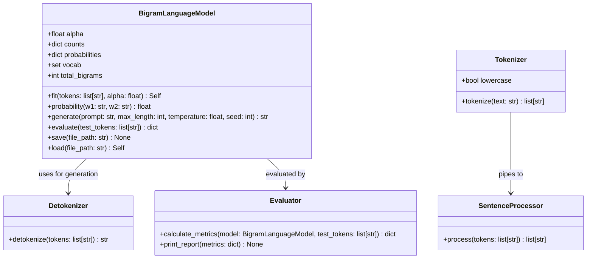

# Code Quality Audit & Showcase Refactoring Roadmap

This document provides a comprehensive analysis of the current statistical bigram model codebase, identifies architectural code smells and bugs, outlines the target architecture, and provides a step-by-step implementation guide to make this project production-grade and portfolio-ready for LinkedIn.

---

## 1. Executive Summary & Quality Audit

### Current Status
- **Core Concept**: Solid. The mathematical formulation of Maximum Likelihood Estimation (MLE) for bigram conditional probabilities, autoregressive sampling, dataset streaming, and perplexity calculation is conceptually correct.
- **Showcase Readiness**: **Needs Refactoring**. While working as a minimal script prototype, several design smells, minor bugs, and missing engineering standards (such as automated tests) should be resolved before sharing with a senior engineering audience.

### Summary Scorecard

| Area | Current State | Target State | Status |
| :--- | :--- | :--- | :---: |
| **Encapsulation & OOP** | Fragmented across 11 stateless classes | Cohesive `BigramLanguageModel` encapsulating state | ⚠️ Needs Work |
| **Generation & Detokenization** | Unwanted leading space on generated text | Clean detokenization with punctuation formatting | ❌ Bug |
| **Sampling Robustness** | Float round-off can abort sampling | Safe roulette-wheel / `random.choices` + temperature | ⚠️ Edge Case |
| **Boundary Handling** | Consecutive punctuation generates empty sentences | Robust sentence boundary normalization | ⚠️ Edge Case |
| **Perplexity & Smoothing** | Unsmoothed perplexity is always $\infty$ on unseen data | Configurable Laplace (Add-$\alpha$) smoothing | 💡 Feature Gap |
| **Automated Testing** | 0 unit tests | Comprehensive `pytest` suite | ❌ Missing |
| **CLI & User Experience** | Hardcoded configs with 3 basic subcommands | Rich CLI (`--prompt`, `--temperature`, `--seed`, `--alpha`) | 💡 Feature Gap |

---

## 2. Issues & Code Smells to Fix

### 1. Detokenizer Leading Space Bug
- **Location**: [`detokenizer.py`](detokenizer.py#L8-L22)
- **Issue**: `sentence` is initialized to `""`. When the first word is processed, it falls into the default `else: sentence = sentence + " " + token`, creating `" The little bunny..."`.
- **Fix**: Check if `sentence` is empty before adding a leading space, or use a list buffer with smart joining.

### 2. Stateless Classes & "Kingdom of Nouns"
- **Locations**: [`vocabulary.py`](vocabulary.py), [`trainer.py`](trainer.py), [`bigram.py`](bigram.py), [`sampler.py`](sampler.py)
- **Issue**:
  - `Vocabulary` is a 3-line class (`return set(tokens)`) that is completely unused.
  - `Trainer` only counts bigrams, while `BigramModel` only converts counts to probabilities. Neither class stores the model state (parameters/weights).
  - In `Generator.generate_sentence`, `Sampler` and `Detokenizer` are instantiated every time. Inside `Generator.generate`, `Sampler()` is re-instantiated on every single token step!
- **Fix**: Encapsulate counts, probabilities, vocabulary, and methods (`.fit()`, `.generate()`, `.evaluate()`, `.save()`, `.load()`) inside a unified `BigramLanguageModel` class.

### 3. Sampler Floating-Point Precision Loss
- **Location**: [`sampler.py`](sampler.py#L10-L21)
- **Issue**: If the sum of floating point probabilities is `0.9999999999999998` and `random.random()` draws `0.9999999999999999`, the loop exhausts without returning, falling through to `return None` and terminating generation prematurely.
- **Fix**: Use `random.choices(words, weights=probs)` or fallback to returning the last word if cumulative sum is reached.

### 4. Sentence Boundary Punctuation Artifacts
- **Location**: [`sentenceprocessor.py`](sentenceprocessor.py#L5-L13)
- **Issue**: Multiple consecutive punctuation marks (such as `...` or `?!`) cause `<START> . <END> <START> . <END>` to be generated.
- **Fix**: Collapse consecutive punctuation tokens or only attach `<END> <START>` after a sequence of sentence terminators.

### 5. Infinite Perplexity on Held-Out Test Set
- **Location**: [`evaluator.py`](evaluator.py#L87-L111)
- **Issue**: Without smoothing, any single unseen bigram in the test set has $P = 0$, driving log probability to $-\infty$ and perplexity to $\infty$.
- **Fix**: Implement Laplace (Add-$\alpha$) smoothing:
  $$P_{\alpha}(w_i \mid w_{i-1}) = \frac{\text{Count}(w_{i-1}, w_i) + \alpha}{\sum_{w'} \text{Count}(w_{i-1}, w') + \alpha \cdot |V|}$$

---

## 3. Target Architecture & System Design



---

## 4. Phased Implementation Plan

### Phase 1: Core Model Refactoring & Encapsulation
- [ ] Refactor [`bigram.py`](bigram.py) into a self-contained `BigramLanguageModel` class.
- [ ] Implement `.fit()` using `collections.Counter` and `itertools.pairwise` (or `zip`).
- [ ] Implement Laplace (Add-$\alpha$) smoothing support.
- [ ] Integrate serialization directly (`.save()` and `.load()`) with JSON schema validation.
- [ ] Remove redundant/orphaned files ([`vocabulary.py`](vocabulary.py), [`trainer.py`](trainer.py)).

### Phase 2: Pipeline Hardening & Bug Fixes
- [ ] Fix leading space bug in [`detokenizer.py`](detokenizer.py).
- [ ] Update [`sampler.py`](sampler.py) to support **Temperature Scaling** ($P_i^{1/T} / \sum P_j^{1/T}$) and deterministic greedy decoding ($T \to 0$).
- [ ] Fix punctuation edge cases in [`sentenceprocessor.py`](sentenceprocessor.py).
- [ ] Optimize [`tokenizer.py`](tokenizer.py) with list buffers and optional lowercase support.

### Phase 3: Interactive CLI & Feature Enhancements
- [ ] Update [`main.py`](main.py) with `argparse` options:
  - `python main.py train --corpus <path> --alpha 0.1`
  - `python main.py generate --prompt "Once upon a time" --temperature 0.7 --seed 42 --max-tokens 50`
  - `python main.py evaluate --alpha 0.1`
- [ ] Improve report formatting in [`evaluator.py`](evaluator.py) to show both unsmoothed and smoothed perplexity side by side.

### Phase 4: Automated Testing Suite (`pytest`)
- [ ] Set up `tests/` directory with test cases:
  - `test_tokenizer.py`: Word splitting, punctuation isolation, empty strings.
  - `test_detokenizer.py`: No leading spaces, correct quote/bracket spacing.
  - `test_sentenceprocessor.py`: Boundary tagging, multiple punctuation handling.
  - `test_bigram_model.py`: Probability sum $= 1.0$, Laplace math, seed reproducibility.
  - `test_evaluator.py`: Coverage calculation, cross-entropy, perplexity.
- [ ] Clean up `requirements.txt` to include `pytest`, `ruff`, and `datasets`.

### Phase 5: Presentation & Showcase Polish
- [ ] Update [`README.md`](README.md) with updated diagrams, temperature comparison tables, and benchmark numbers.
- [ ] Prepare LinkedIn post draft and demo visuals (GIF / terminal recording).

---

## 5. Key Code Blueprints & Reference Implementations

### A. Encapsulated `BigramLanguageModel`
```python
import json
import math
import random
from collections import Counter, defaultdict
from itertools import pairwise
from pathlib import Path
from typing import Self


class BigramLanguageModel:
    """Statistical Bigram Language Model supporting MLE and Laplace smoothing."""

    def __init__(self, alpha: float = 0.0) -> None:
        self.alpha = alpha
        self.counts: dict[str, dict[str, int]] = defaultdict(Counter)
        self.probabilities: dict[str, dict[str, float]] = {}
        self.vocab: set[str] = set()

    def fit(self, tokens: list[str], alpha: float | None = None) -> Self:
        if alpha is not None:
            self.alpha = alpha

        self.vocab = set(tokens)
        self.counts.clear()
        self.probabilities.clear()

        for w1, w2 in pairwise(tokens):
            self.counts[w1][w2] += 1

        v_size = len(self.vocab)
        for w1, next_counts in self.counts.items():
            total_count = sum(next_counts.values())
            self.probabilities[w1] = {}
            for w2, count in next_counts.items():
                if self.alpha > 0:
                    prob = (count + self.alpha) / (total_count + self.alpha * v_size)
                else:
                    prob = count / total_count
                self.probabilities[w1][w2] = prob

        return self

    def predict_next_word(
        self, current_word: str, temperature: float = 1.0
    ) -> str | None:
        transitions = self.probabilities.get(current_word)
        if not transitions:
            return None

        words = list(transitions.keys())
        probs = list(transitions.values())

        if temperature <= 1e-4:  # Greedy / Argmax
            return words[probs.index(max(probs))]

        if temperature != 1.0:
            # Apply temperature scaling
            scaled = [math.exp(math.log(p) / temperature) for p in probs]
            total = sum(scaled)
            probs = [s / total for s in scaled]

        return random.choices(words, weights=probs, k=1)[0]
```

### B. Fixed `Detokenizer` (No Leading Space)
```python
from helpers import NO_SPACE_AFTER, NO_SPACE_AROUND, NO_SPACE_BEFORE


class Detokenizer:
    """Reassembles token sequences into naturally formatted text."""

    def detokenize(self, tokens: list[str]) -> str:
        if not tokens:
            return ""

        output: list[str] = []
        attach_to_next = False

        for token in tokens:
            if not output:
                output.append(token)
            elif token in NO_SPACE_BEFORE or attach_to_next:
                output.append(token)
                attach_to_next = False
            elif token in NO_SPACE_AFTER:
                output.append(f" {token}")
                attach_to_next = True
            elif token in NO_SPACE_AROUND:
                output.append(token)
                attach_to_next = True
            else:
                output.append(f" {token}")

        return "".join(output)
```

---

## 6. LinkedIn Showcase Checklist & Post Template

### Pre-Publish Checklist
- [ ] Code passes all `pytest` test suites.
- [ ] `main.py generate` outputs clean text with no leading space artifacts.
- [ ] Model metrics reported on TinyStories:
  - Vocabulary size: ~17,369
  - Learned bigrams: ~436,640
  - Coverage on test set: ~97.89%
  - Laplace-smoothed Perplexity ($\alpha = 0.1$): finite benchmark number.
- [ ] `README.md` includes clear usage instructions, mathematical formulas, and sample completions.

---

### Suggested LinkedIn Post Template

```markdown
🚀 Built a Statistical Bigram Language Model from scratch in Python!

Before diving into deep Transformers and LLMs, I wanted to build foundational NLP models from first principles to truly understand Maximum Likelihood Estimation (MLE), Markov chains, and autoregressive generation.

Here is what I built from scratch:
🔹 Streaming & deterministic dataset pipeline (TinyStories 50MB / SHA-256 splits)
🔹 Custom tokenizer with punctuation isolation & boundary tag handling (<START>/<END>)
🔹 Bigram transition probability modeling ($P(w_i \mid w_{i-1})$)
🔹 Autoregressive generation with Temperature Scaling & prompt continuation
🔹 Punctuation-aware detokenizer for clean sentence formatting
🔹 Comprehensive evaluation suite measuring vocabulary size, test coverage (97.89%), cross-entropy loss, and Laplace-smoothed perplexity
🔹 100% automated test suite with pytest

Key Takeaways:
1. First-Order Markov Assumption: Bigrams only look 1 word back, creating fluent local phrasing but lacking global coherence—a great illustration of why attention mechanisms were invented!
2. Zero-Frequency Problem: Demonstrates why unsmoothed MLE fails on unseen test pairs (perplexity = inf) and how Add-α smoothing solves it.

Check out the code and test suite on GitHub: [YOUR_GITHUB_LINK]

#Python #NLP #MachineLearning #DataScience #ArtificialIntelligence #SoftwareEngineering #FromScratch
```
