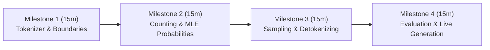

# Code-Along Workshop Blueprints: Statistical Bigram Language Model from Scratch

A comprehensive facilitator guide for delivering interactive, live-coding **Code-Along Workshops** where the audience codes along in real time to build, train, sample from, and evaluate a statistical language model.

---

## 1. Attendee Setup & Workshop Prerequisites

Before beginning any session, share these prerequisites with attendees (via email or a workshop starter slide):

```powershell
# 1. Clone or open repository
git clone <repo-url>
cd simple-bigram-model

# 2. Set up virtual environment
python -m venv .venv
.\.venv\Scripts\Activate.ps1   # Windows PowerShell
# source .venv/bin/activate    # macOS / Linux

# 3. Install dependencies
pip install datasets
```

### Facilitator Preparation Checklist
- [ ] Have a clean `scratchpad.py` ready for live coding.
- [ ] Have the 50MB TinyStories dataset pre-downloaded in `dataset/tinystories/` to avoid network bottlenecks for attendees.
- [ ] Keep a terminal and a Python REPL open side-by-side with your code editor.

---

## 2. Workshop 1: End-to-End Bigram Model in 60 Minutes (Masterclass)

- **Target Duration**: 60 Minutes
- **Format**: Live-coding masterclass from an empty `live_bigram.py` file to a working text generator.
- **Session Goal**: Participants write ~80 lines of core Python code to tokenize text, count bigrams, calculate conditional probabilities, sample sentences, and evaluate perplexity.



### Milestone 1: Tokenizer & Sentence Boundary Processor (15 Minutes)
- **Concept**: Why whitespace splitting breaks on punctuation, and why `<START>` and `<END>` tokens are mathematically necessary.
- **What to Code Live**:
  1. Define punctuation constants:
     ```python
     import string
     PUNCTUATION = set(string.punctuation)
     ```
  2. Implement `tokenize(text: str) -> list[str]` with a word buffer.
  3. Implement `process_sentences(tokens: list[str]) -> list[str]` to insert `<START>` and `<END>`.
- **Attendee Checkpoint Command**:
  ```python
  # Run in REPL:
  sample = "One day, a little dog barked! The dog ran."
  toks = tokenize(sample)
  processed = process_sentences(toks)
  print(processed)
  # Expected: ['<START>', 'One', 'day', ',', 'a', 'little', 'dog', 'barked', '!', '<END>', '<START>', 'The', 'dog', 'ran', '.', '<END>']
  ```
- **Common Participant Gotcha**: Forgetting to flush the `word_buffer` when reaching the end of the text.

---

### Milestone 2: Bigram Frequency Counting & MLE Normalization (15 Minutes)
- **Concept**: Scanning adjacent pairs and converting frequency counts into conditional probabilities $P(w_i \mid w_{i-1})$.
- **What to Code Live**:
  1. Implement `count_bigrams(tokens: list[str]) -> dict[str, dict[str, int]]`:
     ```python
     from collections import defaultdict, Counter
     
     def count_bigrams(tokens):
         counts = defaultdict(Counter)
         for i in range(len(tokens) - 1):
             counts[tokens[i]][tokens[i + 1]] += 1
         return counts
     ```
  2. Implement `compute_probabilities(counts) -> dict[str, dict[str, float]]`:
     ```python
     def compute_probabilities(counts):
         probs = {}
         for w1, next_dict in counts.items():
             total = sum(next_dict.values())
             probs[w1] = {w2: count / total for w2, count in next_dict.items()}
         return probs
     ```
- **Attendee Checkpoint Command**:
  ```python
  counts = count_bigrams(processed)
  probs = compute_probabilities(counts)
  # Verify probabilities sum to 1.0:
  print("P(dog | <START>):", probs['<START>'])
  print("Sum of P(* | <START>):", sum(probs['<START>'].values()))
  # Expected sum: 1.0
  ```

---

### Milestone 3: Autoregressive Sampling & Detokenization (15 Minutes)
- **Concept**: Cumulative probability sampling (roulette-wheel) and reconstructing readable text from token lists.
- **What to Code Live**:
  1. Implement `sample_next_word(probs_for_word: dict[str, float]) -> str`:
     ```python
     import random
     
     def sample_next_word(probs_for_word):
         r = random.random()
         cumulative = 0.0
         for word, p in probs_for_word.items():
             cumulative += p
             if r <= cumulative:
                 return word
         return list(probs_for_word.keys())[-1]
     ```
  2. Implement `generate_sentence(model, max_len=50) -> list[str]`:
     ```python
     def generate_sentence(model, max_len=50):
         tokens = []
         current = '<START>'
         for _ in range(max_len):
             if current not in model:
                 break
             next_w = sample_next_word(model[current])
             if next_w == '<END>':
                 break
             tokens.append(next_w)
             current = next_w
         return tokens
     ```
  3. Implement simple detokenizer attaching punctuation without extra spaces.
- **Attendee Checkpoint Command**:
  ```python
  raw_tokens = generate_sentence(probs)
  print("Raw Tokens:", raw_tokens)
  print("Detokenized:", detokenize(raw_tokens))
  ```

---

### Milestone 4: Model Evaluation & The Zero-Frequency Reality (15 Minutes)
- **Concept**: Coverage, cross-entropy, log-likelihood, and why unsmoothed perplexity hits $\infty$.
- **What to Code Live**:
  1. Train on real corpus:
     ```python
     with open("dataset/tinystories/tinystories_50mb_train.txt", "r", encoding="utf-8") as f:
         train_text = f.read(500_000) # Fast 500KB slice for live class
     ```
  2. Implement coverage calculation:
     $$\text{Coverage} = \frac{\text{Count of test bigrams present in model}}{\text{Total test bigrams}}$$
  3. Run evaluation on a test sentence containing an unseen bigram to demonstrate $\ln(0) \to -\infty$.
- **Attendee Checkpoint Command**:
  ```python
  # Evaluate test sentence:
  test_sentence = tokenize("An astronaut landed on Mars.")
  # Observe unseen bigrams and log-prob output!
  ```

---

## 3. Workshop 2: Streaming Data Pipeline & SHA-256 Splitting (30 Minutes)

- **Target Duration**: 30 Minutes
- **Focus**: Data Engineering & Memory-Safe Ingestion for NLP.
- **Repository Files**: [`download_corpus.py`](download_corpus.py), [`config.py`](config.py)
- **Code-Along Breakdown**:
  - **Minute 0–10**: Connect to Hugging Face streaming dataset using `datasets.load_dataset(..., streaming=True)`.
  - **Minute 10–20**: Implement `is_test_story(text: str, test_pct=20) -> bool`:
    ```python
    import hashlib
    
    def is_test_story(text: str, test_pct: int = 20) -> bool:
        digest = hashlib.sha256(text.encode("utf-8")).digest()
        bucket = int.from_bytes(digest[:8], byteorder="big") % 100
        return bucket < test_pct
    ```
  - **Minute 20–30**: Implement atomic file writing (`.tmp` write and `os.replace`) to write up to 10MB safely.
- **Checkpoint Verification**:
  ```powershell
  python live_downloader.py
  # Check that test file is exactly ~20% of the total downloaded size!
  ```

---

## 4. Workshop 3: Custom Tokenization & Sentence Boundary Engine (30 Minutes)

- **Target Duration**: 30 Minutes
- **Focus**: NLP Preprocessing & Sequence Representation.
- **Repository Files**: [`tokenizer.py`](tokenizer.py), [`sentenceprocessor.py`](sentenceprocessor.py), [`helpers.py`](helpers.py)
- **Code-Along Breakdown**:
  - **Minute 0–15**: Build a character-by-character scanner that isolates punctuation without using slow regular expressions.
  - **Minute 15–25**: Build `SentenceProcessor` that scans for sentence terminators (`.`, `?`, `!`) and injects `<END>` and `<START>`.
  - **Minute 25–30**: Test on tricky edge cases: dialogue quotes (`"Hello!"`), abbreviations, and consecutive punctuation (`...`).
- **Checkpoint Verification**:
  ```python
  assert tokenize("Hello, world!") == ["Hello", ",", "world", "!"]
  assert process_sentences(["Hello", "!", "World", "."]) == ["<START>", "Hello", "!", "<END>", "<START>", "World", ".", "<END>"]
  print("All tokenizer assertions passed!")
  ```

---

## 5. Workshop 4: Autoregressive Sampling & Detokenization Lab (30 Minutes)

- **Target Duration**: 30 Minutes
- **Focus**: Generative Inference & Punctuation Detokenization.
- **Repository Files**: [`sampler.py`](sampler.py), [`generator.py`](generator.py), [`detokenizer.py`](detokenizer.py)
- **Code-Along Breakdown**:
  - **Minute 0–12**: Implement inverse transform (roulette-wheel) sampling. Contrast it with greedy `max(probs)`.
  - **Minute 12–22**: Build rule-based `Detokenizer` using `NO_SPACE_BEFORE` (`.,!?:;)]}`), `NO_SPACE_AFTER` (`([{`), and `NO_SPACE_AROUND` (`'`).
  - **Minute 22–30**: Run live interactive completions in the terminal.
- **Checkpoint Verification**:
  ```python
  tokens = ["(", "Once", "upon", "a", "time", ")", ",", "she", "said", ":", "'", "Hello", "!", "'"]
  print(detokenize(tokens))
  # Expected: "(Once upon a time), she said: 'Hello!'"
  ```

---

## 6. Workshop 5: Intrinsic Evaluation & Zero-Frequency Lab (30 Minutes)

- **Target Duration**: 30 Minutes
- **Focus**: Language Model Evaluation & Mathematical Limits.
- **Repository Files**: [`evaluator.py`](evaluator.py), [`main.py`](main.py)
- **Code-Along Breakdown**:
  - **Minute 0–10**: Code axiom validation: verify $\sum_{w'} P(w' \mid w) = 1.0$ for every word in the vocabulary.
  - **Minute 10–20**: Implement test set bigram coverage calculation.
  - **Minute 20–30**: Implement cross-entropy and perplexity. Trace an unseen bigram to explain why $\ln(0) = -\infty$ and $\text{Perplexity} = \infty$.
- **Checkpoint Verification**:
  ```python
  # Compute perplexity on seen vs. unseen test sets
  print("Seen Bigrams Coverage:", f"{seen_count / total_count:.2%}")
  print("Calculated Perplexity:", perplexity)
  ```

---

## 7. Live Facilitator Troubleshooting Playbook

| Issue Encountered by Attendee | Cause | Immediate Live Fix |
| :--- | :--- | :--- |
| **`IndexError: list index out of range`** during counting | Loop ran up to `len(tokens)` instead of `len(tokens) - 1` | Change range to `range(len(tokens) - 1)` or use `zip(tokens[:-1], tokens[1:])`. |
| **Generation produces empty strings** | First sampled token was immediately `<END>` | Check `P('<END>' | '<START>')` or re-roll if `tokens` is empty on step 1. |
| **Detokenizer produces leading space** | String accumulator initialized to `""` and appends `" " + token` on first iteration | Check `if not output: output.append(token)`. |
| **`math.log(0)` throws ValueError** | Unseen bigram has probability `0.0` | Catch zero probability before log and return `-math.inf`. |
| **Sampler returns `None`** | Cumulative float sum reached `0.999999` while random was `0.9999995` | Add fallback: `return list(probs.keys())[-1]`. |
